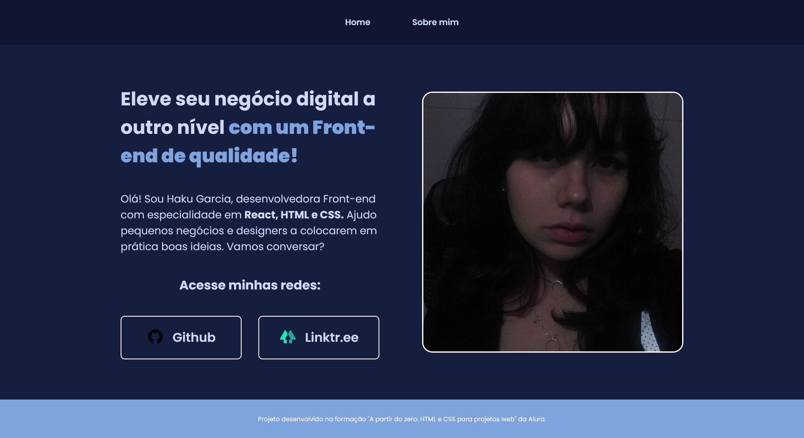

<h1 align="center">
    🫐 Portfólio
</h1>

Projeto de estudo  <strong> Front-End.</strong>
 
<strong>Front-End</strong> study project. 

 

  

    <h2>☆</h2>
    
PT/BR

    

    O principal objetivo desse projeto é praticar Front-End. 
    Esse projeto foi criado com base na formação <strong> A partir do zero: HTML e CSS para projetos web </strong> da Alura.

    <h2>☆</h2>
    
EN

    

    The main objective of this project is to practice Front-End. 
    This project was created based on the Alura's training <strong> A partir do zero: HTML e CSS para projetos web </strong> 

     
    

     
    

